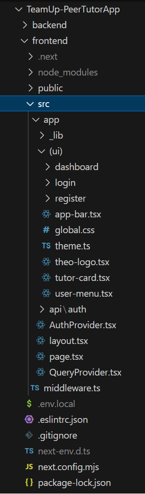
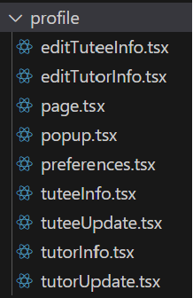
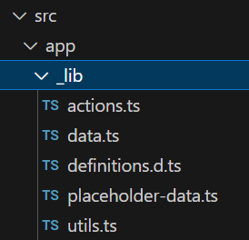
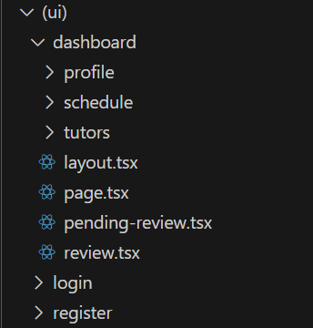

# Design Documentation
## File Structure
### Frontend
Since this is a Next.js application, we have utilized the app router file structure from Next.js. This means that the routes for various pages is determined by the folder names. 

Above is an image of our file structure for our frontend, found under the /frontend folder.
#### Static Images

All static images and icons are stored under the /frontend/public folder, as highlighted above. This will allow any of the webpages to see and use these images

#### Global Functions and Definitions (Types/Classes)

The /frontend/src/app/_lib folder contains all global functions and definitions that can be imported into any other page.

Under the _lib folder, /data.ts stores all of our database manipulation and fetching functions.

/utils.ts contains all of the global helper functions that might be useful for various different pages.

/definitions.d.ts contains all of the class and type declarations that are implicitly imported into all files in the project.

/placeholder-data.ts contains any placeholder database data for testing locally.

#### Webpages and Routing

The /frontend/src/app/(ui) folder contains all the React Typescript files for the webpages of the application.

Each folder represents a URL path of the application, for example: files under /(ui)/dashboard/ will render under tamutheo.xyz/dashboard 

For any given folder, there can be many .tsx, each representing a single React component or multiple related React components, but one file must be called page.tsx and that is the file that will be rendered under that specific path in the application. All other components in the other files can be imported into page.tsx to be rendered. 

